<!-- _backgroundColor: white -->
<style type="text/css">
    img {
  	    background-color: transparent!important;
    }
    img[alt~="center"] {
      display: block;
      margin: 0 auto;
    }
    .language-rust {
      background-color: black!important;
    }
</style>


## ABM in Rust: Parallelismo e Visualizzazione
By Francesco Foglia & Pasquale Caramante

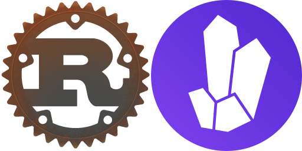

---
<!--
  L'obiettivo delle simulazioni agent-based è di trovare delle caratteristiche (regole) del sistema interessato in base al comportamento delle singole unità (agenti) e come interagiscono fra di loro.
-->

# Cosa sono le simulazioni agent-based?


---

# Cos'è Rust?
### Rust è un linguaggio di programmazione di sistemi che si può esprimere attraverso tre keyword:
- Performance
- Reliability
- Productivity

---

[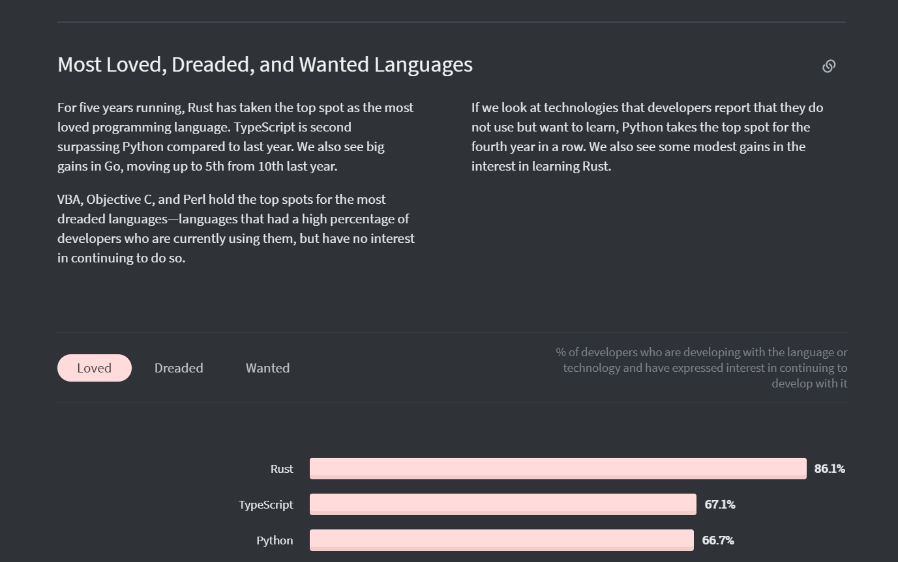](https://insights.stackoverflow.com/survey/2020#technology-most-loved-dreaded-and-wanted-languages-loved)

---

## Performance
Comparabile a C. Un programma scritto con Rust è già molto performante di base rispetto a programmi scritti in altri linguaggi, come Java o Go, grazie alla mancanza di un garbage collector e alle varie ottimizzazioni eseguite dal potente compiler

---

## Reliability
Varie classi di bug vengono rimosse al compile-time (la gestione della memoria permette, inoltre, la "fearless concurrency")

---

## Productivity
Può sembrare difficile da usare, ma in realtà il linguaggio collabora con noi tramite errori ben definiti, una documentazione robusta e una community amichevole, assieme a Cargo, un package manager versatile e facile da usare

---
## Esempio: Arctix vs Node


---


---
<!-- Inizio parte Multithreading -->

* ## Fearless Concurrency

* ## Multithreading nella libreria standard di Rust (il modulo std::thread)

* ## Comunicazione fra Thread
    * Scambio di messaggi
    * Memoria condivisa

* ## Rayon

---

# Rust & "Fearless Concurrency"
Parallelizzare la computazione può migliorare significativamente le performance, ma allo stesso tempo può introdurre diverse problematiche.
**Rust** offre la possibilità di scrivere codice parallelo sicuro, privo di **data races**, impedendo di compilare sorgenti che violerebbero queste caratteristiche.

**Come?**
Tramite le regole di **Ownership** e **Borrowing** ( e **Type Checking**!)

---
# Modelli di Multithreading
* **1:1**
    * ogni Thread creato corrisponde ad un Kernel Thread
    * thread implementati dal Sistema Operativo
* **M:N** (*Green Threading*):
    * M User Thread su N Kernel Thread
    * implementazione specifica del linguaggio di programmazione

**Rust** adotta il modello di Multithreading 1:1, ma non preclude la possibilità di implementare il Green Threading.

---

```rust
use std::thread;

  fn main(){

      let handle = thread::spawn( || {
        println!("Ciao dal thread spawnato!");      
      });

    handle.join().unwrap();
  }


``` 
Usiamo la funzione ```thread::spawn()``` per creare un nuovo thread e ci viene restituito un valore di tipo ```JoinHandle```, che ci permette di attendere la terminazione del thread creato.

---
##### Thread Safety
```rust
use std::thread;

  fn main(){
      let x=String::from("Il valore di y è:");
      let y=5;

      let handle = thread::spawn( || //ERRORE! { 
            let stringa = format!("{} {}",x,y);
            println!("{}",stringa);
      });

    println!("x:{}",x);
    println!("y:{}",y); 
    handle.join().unwrap();
    }
```

---
##### Thread Safety
```rust
use std::thread;
  fn main(){
      let x=String::from("Il valore di y è:");
      let y=5;
      let handle = thread::spawn( move ||{ 
            let stringa = format!("{} {}",x,y);
            println!("{}",stringa);
      });
    println!("x:{}",x); //Il compilatore segnalerà un errore su questa linea
    println!("y:{}",y); 
    handle.join().unwrap();
    }
```
Aggiungiamo la parola ```move``` alla definizione della closure... perchè?

---


## Comunicazione fra Thread
#### Scambio di messaggi
Si utilizza un canale di comunicazione per scambiare dati fra diversi thread. Questo canale è diviso in due metà: un lato trasmette e l'altro riceve.
#### Memoria Condivisa
Thread diversi condividono simultaneamente l'accesso alle stesse locazioni di memoria.

---

## Scambio di Messaggi
### ```std::sync::mpsc::channel()```
Restituisce una tupla  ```(Sender,Receiver)```;
Trasmettiamo dati con il valore ```Sender``` tramite il metodo ```send()```, e riceviamo con il ```Receiver``` tramite il metodo ```recv()``` (bloccante).

```rust
use std::sync::mpsc;
...
let (produttore,consumatore) = mpsc::channel();
...
```
---
## Scambio di Messaggi e Ownership
I valori ```Sender``` e ```Receiver``` sono valori di proprietà:
* i thread possono prenderne proprietà implicitamente
* le variabili fuori scope vengono deallocate automaticamente

Inoltre, la funzione ```send()``` prende proprietà del valore che spediamo, impedendone quindi l'utilizzo successivamente se il valore appartiene ad un tipo non primitivo.
```rust
let stringa = String::from("Stringa");
trasmettitore.send(stringa).unwrap();
println!("{}",stringa); //<--- Errore
```
---

### Dal Produttore al Consumatore... (Scambio 1 a 1)
```rust
use std::sync::mpsc;
use std::thread;

  fn main(){
    let (produttore,consumatore) = mpsc::channel();

    thread::spawn( move ||{ 
            let x=42;
            produttore.send(x).unwrap();
      });
    
    let risultato = consumatore.recv().unwrap();
    println!("Ricevuto: {}",risultato);
    }
```

---
##### ...e se avessimo più di un produttore?
###### MPSC = Multiple Producers Single Consumer
```rust
...
let (produttore,consumatore) = mpsc::channel();
    for i in 0..5{
        let produttore_locale = mpsc::Sender::clone(&produttore);
        thread::spawn( move ||{ 
            let stringa = format!("{}{}","Ciao dal thread n.",i+1);
            produttore_locale.send(stringa).unwrap();
        });
    }
    drop(produttore);

    for ricevuto in consumatore{
        println!("{}",ricevuto);
    }
```
---
## Memoria Condivisa

Rust offre le seguenti primitive per gestire più thread che lavorano sugli stessi dati:

* ```Mutex<T>```(**Mut**ual **Ex**clusion) per sincronizzare gli accessi dei diversi thread


* ```Arc<T>```(**A**tomic **R**eference **C**ounter) per gestire l'esistenza di diversi proprietari (i thread) per gli stessi dati

Sia ```Mutex<T>``` che ```Arc<T>``` sono Smart Pointers.

---

# ```Mutex<T>```
Struttura che permette l'accesso ai dati in mutua esclusione, tramite chiamata del metodo ```lock()```. La chiamata di questo metodo blocca il thread corrente finchè la risorsa non è disponibile.
```rust
use std::sync::Mutex;
fn main() {
    let m = Mutex::new(5);
    {
        let mut num = m.lock().unwrap();
        *num = 6;
    }
    println!("m = {:?}", m);
}
```

---
### ```Arc<T>```
Versione thread-safe del tipo ```Rc<T>```, che a sua volta permette ad un valore di avere più proprietari, esclusivamente in ambito single-thread. ```Arc<T>``` sfrutta operazioni atomiche per garantire la sicurezza in ambito multithread.

L'idea è quella di sfruttare ```Arc<T>``` per condividere in maniera totalmente thread-safe un ```Mutex<T>``` che sincronizzerà gli accessi dei vari thread.

---

```rust
...
let somma = Arc::new(Mutex::new(0));
let num_thread = 8;
let mut handles = vec![];
let thread_division = end/num_thread; //Calcola fin dove conterà ogni thread

for _ in 0..num_thread{
    let local_mutex = Arc::clone(&somma);
    let handle = thread::spawn( move || {
            let mut thread_sum = local_mutex.lock().unwrap();
            for _ in 0..thread_division{
                *thread_sum +=1;
            }
        });
    handles.push(handle);
}
//Join
//Stampa somma
...
```

---
### Riassumendo...

* Rust garantisce (staticamente) programmi multithread thread-safe e privi di data race, semplicemente grazie alle regole di Ownership, Borrowing e Type Checking.
* Rust non garantisce codice privo di Deadlock e Race Condition 
* Gran parte delle funzionalità legate al multithreading in Rust non fanno parte del linguaggio, ma di librerie, lasciando agli sviluppatori la libertà di implementare le proprie primitive multithread

---
# Rayon 

Libreria che offre funzionalità per parallelizzare il codice in maniera semplice, intuitiva ed elegante:
* Iteratori Paralleli
* ThreadPool Customizzabili
* Overhead poco significativo
* Priva di data races


---

# Rayon

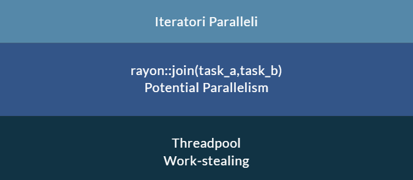

---

```rust
fn moltiplicazione_mat(m1:&[Vec<u32>], m2:&[Vec<u32>],n:usize) -> Vec<Vec<u32>> {
  (0..n)
  .map(|i| {
      (0..n)
          .map(|j| (0..n)
            .map(|k| m1[i][k] * m2[k][j]).sum()).collect::<Vec<u32>>()
  }).collect::<Vec<Vec<u32>>>()
}
```

Output:
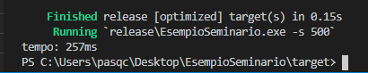

---

```rust
fn moltiplicazione_mat_parallelo(m1:&[Vec<u32>],m2:&[Vec<u32>],n:usize) -> Vec<Vec<u32>> {

  (0..n).into_par_iter()
  .map(|i| {
      (0..n)
          .map(|j| (0..n)
            .map(|k| m1[i][k] * m2[k][j]).sum()).collect::<Vec<u32>>()
  }).collect::<Vec<Vec<u32>>>()
}
```
Output:
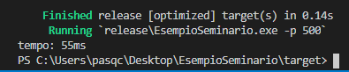

---

# Librerie basate su Rayon

* rust-agent-based-models: https://github.com/facorread/rust-agent-based-models :
  * Libreria per simulazioni agent-based che sfrutta un'architettura ECS basata sugli iteratori paralleli di Rayon

* Amethyst: https://github.com/amethyst/amethyst :
  * Game Engine basato su un ECS chiamato Specs (**S**pecs **P**arallel **ECS**) (https://github.com/amethyst/specs) che a sua volta sfrutta i threadpool di Rayon per parallelizzare automaticamente la computazione di sistemi.


---

# Rust e Game Dev
La situazione attuale di Rust nell'ambiente del game dev si può esprimere tramite la [citazione](https://arewegameyet.rs/):
## "Almost. We have the blocks, bring your own glue."
I "blocchi", ovvero le componenti, esistono e coprono la maggior parte dei bisogni di un developer di videogiochi

---

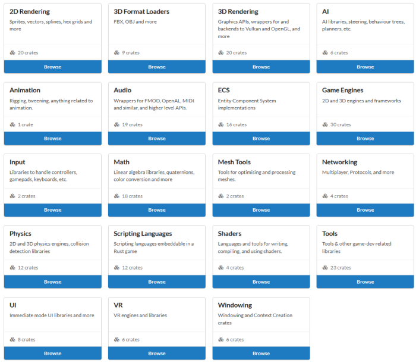

---

# Cos'è Amethyst?
### Amethyst è un tentativo nel creare questa "colla", un game engine che ha scelto come sue fondamenta performance, modularità e un approccio orientato ai dati

---

## Performance
La scelta di un modello entità-componenti (ECS) come base della logica del gioco rende possibile parallelizzare gran parte di ciò che succede "dietro il sipario", permettendo allo sviluppatore di preoccuparsi di meno del parallelismo

---

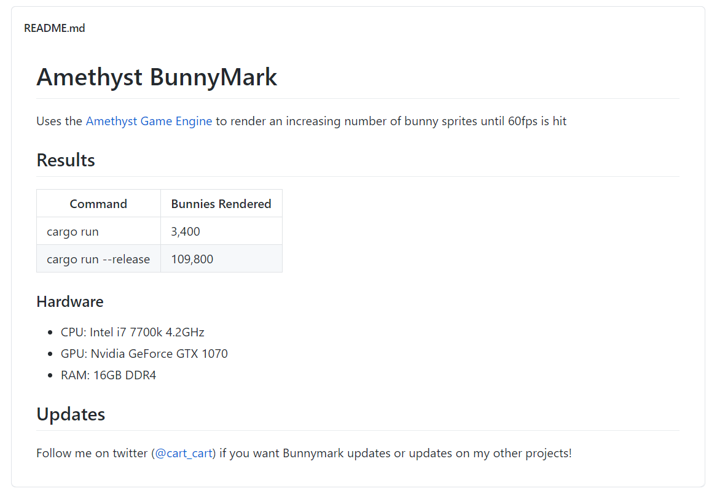

---

## Modularità
I vari moduli usati da Amethyst (rendy come renderer, basato su gfx-hal, rodio per la parte audio...) sono facilmente scambiabili con alternative facilmente integrabili

---

## Data-oriented
<!-- Esempio: componenti di un ECS e la loro posizione nella memoria, ottimizzata per la cache locality -->
Le entità del gioco sono semplicemente contenitori di dati, le operazioni sono relative a determinati tipi di dati (esempio: spostare una entità da un punto ad un altro) e non hanno bisogno dell'intera mole di dati rispettiva all'entità (la cache viene riempita solo con i dati che vogliamo effettivamente trattare)

---

# Data-driven
<!-- Logica implementata in modo generico per trattare i vari tipi di dati -->
La logica del gioco è gestita in modo astratto, come una semplice transformazione di dati. Un sistema specifica quali tipi di dati richiede e una volta forniti, li tratta e restituisce il risultato.

---
<!-- Viral16/07/2020
I didn't create a list of rendy mistakes.
In short, rendy has terrible usability.
It inherits generic parameter from gfx instead, while it should hide it.
It has very-high level abstraction - frame-graph. And very low-level in every other aspect.
Focusing on the frame-graph was a mistake as well. It should be natural abstraction over graphics API. But in rendy API usability was sacrificed for frame-graph.
I had had no experience writing graphics applications (not an expert today, but hey, at least I've made a few simple ones) and frame-graph turned out half-broken. And so we created another abstraction over frame-graph in amethyst_rendy. Which still puzzles amethyst users.
As a result almost no one wants to touch rendering in amethyst.-->
# Struttura di Amethyst
- Amethyst_animation
- Amethyst_assets (da rimuovere in favore di [atelier-assets](https://github.com/amethyst/atelier-assets))
- Amethyst_audio ([Rodio](https://github.com/RustAudio/rodio))
- Amethyst_input ([Winit](https://github.com/rust-windowing/winit))
- Amethyst_gltf ([glTF](https://github.com/gltf-rs/gltf)(3d))
- Amethyst_network ([laminar](https://github.com/amethyst/laminar))
- Amethyst_rendy ([rendy](https://github.com/amethyst/rendy), astrazione di gfx-hal, punto debole)
- Amethyst_ui (Capacità UI estremamente basiche)
- Amethyst_core ([Specs](https://github.com/amethyst/specs), da scambiare con [Legion](https://github.com/TomGillen/legion))

---

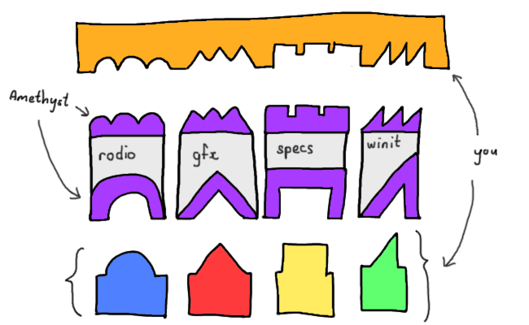

---

<!-- 
- State design pattern (basato su un automa a pila))
- ECS (entità le cui caratteristiche dipendono dalle componenti che le compongono)
- Resources (container di dati indipendenti)
- World (container di resources)
- System (contenente la logica del gioco eseguita ad ogni iterazione del game loop, in parallelo se possibile)
- Dispatcher (praticamente gli scheduler dei systems. Rispettano le regole della gestione della memoria di rust, massimizzando il parallelismo: execution stages)
- Event channel (coda di eventi broadcast per la comunicazione tra sistemi di tipo 1-N)
 -->
# Concetti di Amethyst
- State design pattern
- ECS
- Resources
- World
- System
- Dispatcher
- Event channel

---

# Confronto con Unity

- ECS (gestito diversamente, ma Unity DOTS si avvicina)
- Prefabs (structs con PrefabData, istanze = RON files)
- Modularità (non presente in Unity, poiché è closed-source)

<!--
- Entrambi gli engines sono basati su un modello ECS, anche se nel dettaglio vengono gestiti in modo diverso (Unity: funzionalità implementate dal singolo componente, MonoBehaviour) (Amethyst: funzionalità implementare su una categoria di componenti, System)
- Prefabs (Amethyst: structs che implementano il trait PrefabData, le singole istanze sono ron files che non hanno bisogno di ricompilazione)

---

- Unity forza le proprie regole sullo sviluppatore, il quale può specificare la logica del gioco o altro, ma non può scendere nei dettagli, poiché è un game engine closed source.
Amethyst permette all'utente di cambiare i pezzi che lo compongono, dando più potere ad esso, ma da ciò derivano anche più responsabilità e più pericoli.
-->

---

<iframe src="https://player.vimeo.com/video/332649771?muted=1" width="1100" height="600" frameborder="0" allowfullscreen></iframe>

---

# Estensioni: ImGUI bindings
<!--
La crate dedicata all'UI è molto basilare, per questo motivo è stata realizzata un'altra crate, amethyst_imgui, per poter creare un UI basato su Dear ImGUI (C/C++), con dei binding appositi per rendere safe l'utilizzo.
## Perché Dear ImGUI?
Le caratteristiche di questa libreria GUI sono: velocità, portabilità e autosufficienza (bloat-free), assieme ad uno sviluppo veloce.
-->
- Amethyst_UI estremamente basilare
- Modulo secondario: Amethyst_ImGUI (Dear ImGUI, C/C++ bindings)
- Velocità, portabilità, autosufficienza (bloat-free), sviluppo rapido

---


---

# Estensioni: specs_physics
Una delle componenti considerate fondamentali nei game engine odierni è il motore fisico. Amethyst non ne ha uno di base, ma questa crate adatta il motore fisico più popolare e non basato su bindings, nphysics https://nphysics.org/
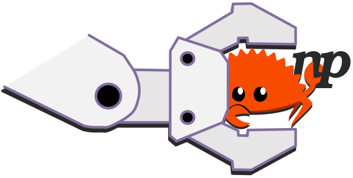

---

# Estensioni: Georust

I dati geospaziali (GIS data) sono molto usati nelle simulazioni per la creazione dell'environment.

Rust ha [vari tools](https://github.com/georust) in merito, ma manca un tool per la visualizzazione.


<!--
Nei framework moderni per le simulazioni ad agenti, è presente il supporto ai dati geospaziali (GIS data) per caricare l'ambiente nel quale avviene la simulazione. In Rust, esiste il supporto per le primitive geospaziali (punti, linee, poligoni), assieme ad altre librerie di supporto, ma non esiste una libreria per la visualizzazione di tali dati.
-->

---

# Pro e contro di Amethyst
\+ Engine altamente parallelo e performante grazie a Specs e Rendy, a sua volta basato su gfx-hal, una API molto simile a Vulkan

\+ Free e open-source (MIT/Apache 2.0)

\+ Supporto al 2D e al 3D, a glTF e al caricamento di asset in parallelo

---

\- La parte grafica è alquanto limitata, in particolare per la visualizzazione di dati tramite grafici. ImGUI permette la creazione di soli due tipi di grafici: istogrammi e a linee, quindi potrebbe essere necessario l'utilizzo di una libreria dedicata, come [Plotters](https://github.com/38/plotters)

\- La visualizzazione di dati GIS va fatta manualmente e la parte di grafica 2D è limitata al semplice rendering di sprites. Disegnare linee o altre primitive in modo dinamico sembra possibile solo tramite un componente di debug o attraverso amethyst-rendy, ovvero tramite shaders

---

\- Mancanza di features fondamentali e instabilità di quelle esistenti, come ad esempio lo switch del renderer che ha quasi fermato il progetto, o l'inattività di crates fondamentali come quella dedicata alla fisica, oltre al recente cambiamento della crate alla base dell'ECS ([Specs->Legion](https://csherratt.github.io/blog/posts/specs-and-legion/))

<!--
\- L'unico adattatore per un motore fisico esistente (specs-physics) sembra essere inattivo, la causa potrebbe essere lo switch dell'ECS. (Ultimo commit: 4 maggio, dipendenza nphysics vecchia di 3 versioni)
-->

\- Ancora molto lavoro da fare per arrivare ad una versione realmente competitiva con gli engine attuali

---

## Esempi
```rust
let app_root = application_root_dir()?;
let resources = app_root.join("resources");
let display_config = resources.join("display_config.ron");
let game_data = GameDataBuilder::default()
    .with_bundle(
            RenderingBundle::<DefaultBackend>::new()
                .with_plugin(
                    RenderToWindow::from_config_path(display_config)?
                        .with_clear([1, 1, 1, 1]),
                )
                .with_plugin(RenderDebugLines::default())
                .with_plugin(RenderFlat2D::default())
                .with_plugin(RenderImgui::<amethyst::input::StringBindings>::default()),
        )?;
let mut game = Application::new(resources, state::MyState, game_data)?;
game.run();
```

---

##### Stato
```rust
pub struct MyState;
impl SimpleState for MyState {
  fn on_start(&mut self, data: StateData<'_, GameData<'_, '_>>) {
        let world = data.world;
        let dimensions = (*world.read_resource::<ScreenDimensions>()).clone();
        init_camera(world, &dimensions);
        world.register::<DebugLinesComponent>();
        let mut debug_lines_component: DebugLinesComponent = DebugLinesComponent::new();
        debug_lines_component.add_line(
          Point3::new(100. + dimensions.width() * 0.5,100. + dimensions.height() * 0.5,0.),
          Point3::new(200. + dimensions.width() * 0.5,200. + dimensions.height() * 0.5,0.),
          Srgba::new(1., 0., 0., 1.));
        world
            .create_entity()
            .with(debug_lines_component)
            .build();
  }
}
```

---

##### Caricamento di una icona
```rust
let loader = world.read_resource::<Loader>();
let texture_handle = {
  let texture_storage = world.read_resource::<AssetStorage<Texture>>();
  loader.load("texture/spritesheet.png", ImageFormat::default(), (),
              &texture_storage,
  )
};
let sprite_sheet_store = world.read_resource::<AssetStorage<SpriteSheet>>();
let sprite_render = SpriteRender::new(
  loader.load("texture/spritesheet.ron", SpriteSheetFormat(texture_handle),
    (), &sprite_sheet_store,
  )
,0);
world.create_entity()
    .with(sprite_render.clone())
    .build();
```

---

# Altri game engines in Rust
Purtroppo, in ambito game dev siamo ancora agli stadi iniziali. Però, ci sono molti tentativi atti a produrre un valido game engine che può contrastare i giganti quali Unity e Unreal Engine.

---


In un certo senso è uno spin-off di Amethyst, molto recente (10 agosto 2020) e con obiettivi specifici che possono essere riassunti in due parole: user experience. Si differenzia per la scelta di ottimizzare i tempi di compilazione (famoso punto debole di Rust), l'uso di un renderer diverso (Wgpu, molto più semplice di Rendy) e un focus sull'UI (l'obiettivo è di unificare UI dei giochi con l'UI dell'editor). Attualmente gli sviluppatori di Bevy collaborano con quelli di Amethyst fortunatamente.

---


Il game engine ggez è leggero, cross-platform e si basa sulle ideologie di [LÖVE](https://love2d.org/), in particolare per la sua semplicità. È per lo sviluppo di giochi 2D ed è preferito rispetto ad Amethyst per il mondo 2D.

---

<!-- Inizio parte ABM -->
# ABM: Agent Based Modelling
Tecnica per realizzare modelli di sistemi complessi, al fine di simularne il comportamento.

* il comportamento di un sistema può essere visto come risultato delle azioni e interazioni di agenti che ne fanno parte
* approccio bottom-up
* intuitività

---

# ABM: Agent Based Model

Modelli utilizzati per simulare ed osservare il comportamento di un sistema complesso, tramite la simulazione di azioni e interazioni a livello locale.
Le componenti di un **ABM** sono:
* un insieme (anche eterogeneo) di agenti
* regole decisionali
* relazioni

Applicazioni tipiche: biologia, sociologia, meteorologia, economia...

---

# Agenti
Un agente del modello è un'entità **discreta** e **autonoma**.
* assume dei comportamenti in base alle regole decisionali
* interagisce con altri agenti, influenzandone i comportamenti

Molti sistemi complessi possono essere modellati con un approccio bottom-up:
l'interazione fra i singoli agenti dà luogo a fenomeni complessi, detti **comportamenti emergenti**.


---


# Il modello Boids (Birds)
Modello costruito per simulare il volo di stormi di uccelli.
* realizzato nel 1986, da Craig Reynolds
* ogni agente si muove in uno spazio bidimensionale
* ogni agente tiene conto della posizione dei suoi "vicini"
* tre regole: **separazione, allineamento, coesione**


---
# ABM e OOP

L'intuitività degli ABM si sposa naturalmente con il paradigma OOP.
Un'implementazione di base potrebbe prevedere:
* una classe Agent che rappresenta il concetto di agente del modello
* una classe Model 
* una classe che rappresenta l'ambiente in cui esistono gli agenti


---
# Problemi negli ABM
* Astrazione vs Realismo
* Efficienza e ottimizzazione
* Sincronizzazione


---

# RustAB
Libreria ready-to-use per simulazioni agent-based realizzata in Rust:
* ispirata a MASON (Java)

* prestazioni migliori rispetto a librerie più diffuse (MASON,NetLogo)
---

## Architettura RustAB

#### Agent
Trait implementato dalle struct che vogliamo usare come agenti. Fornisce un metodo step() che racchiude la logica dell'agente.

#### AgentImpl
Struct che funziona da wrapper per gli agenti. Fornisce questi ultimi di un id e un valore booleano che rappresenta la modalità di scheduling fra due possibili scelte.


---

#### Location2D

Trait implementabile da qualsiasi struct che ha bisogno di esporre una posizione(intesa come coppia di coordinate) in uno spazio bidimensionale. È richiesta l'implementazione di getter e setter per le coordinate.
#### Field2D
Matrice che permette di modellare facilmente le interazioni degli agenti con i rispettivi vicini, in uno spazio bidimensionale.


---


#### Schedule
Oggetto che gestisce gli eventi che hanno luogo ad ogni step della simulazione. Funziona come una coda a priorità in cui  gli agenti vengono schedulati e ordinati volta per volta, in base all'istante di scheduling e ad un valore che rappresenta la priorità. 

#### Priority
Struttura che gestisce la priorità di un agente nello scheduling, offre metodi di confronto per stabilire l'ordinamento degli agenti nella coda a priorità. 


---

#### State
Struttura che rappresenta lo stato globale della simulazione, contenente tutti i campi e le variabili.
Deve essere accessibile dal corpo della funzione step() degli agenti, per questo motivo è definita come una variabile globale, il cui accesso è regolato da un Mutex.

---


# Perché visualizzare queste simulazioni?
L'obiettivo delle simulazioni è quello di ricreare un sistema complesso a partire da singole unità (agenti). Tramite la visualizzazione di tale simulazione, possiamo osservare una valida riproduzione di tale sistema, e notare particolarità dell'intero sistema o di gruppi di agenti.

---

Inoltre, la visualizzazione rende anche la simulazione più semplice da capire, quindi più effettiva, associando alle sue componenti dei simboli con un forte significato.

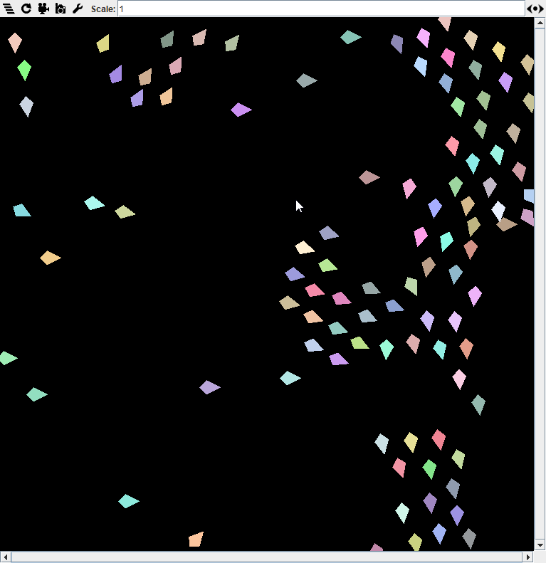 


---

# Rust AB Visualization

Lo sviluppo del framework atto alla visualizzazione può seguire un processo simile a quello implementato da MASON, adattandolo però all'ambiente basato su entità e componenti.

---

## Perché Amethyst? ([Amethyst](https://github.com/Carbonhell/amethyst-bunnymark) vs [MASON](https://github.com/Carbonhell/MASONBunnyMark))
<iframe style="width:100%; margin: 0 auto" height="550" src="https://embed.chartblocks.com/1.0/?c=5f61df8d3ba0f6b00d73a254&t=14707d8ecdf0fd4" frameBorder="0"></iframe>

---

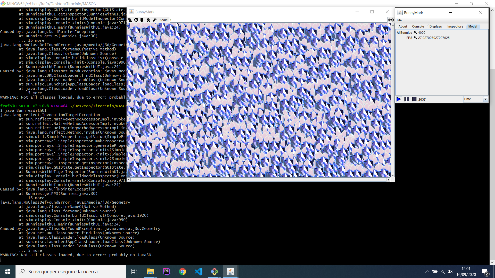

---

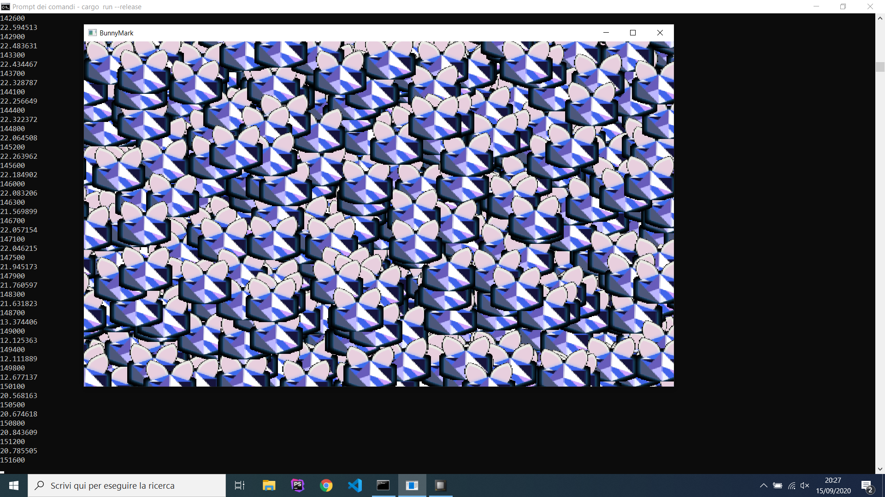

---

# Architettura

L'idea di base è quella di usare questo framework come plug-in con una interfaccia ben definita per gestire i vari tipi di eventi della simulazione (step, interazione fra agenti...)

---

# Requisiti lato modellatore
Lo sviluppatore del modello aggiunge delle specifiche chiamate nel codice del suo modello, specificando in che modo le varie componenti vanno visualizzate. Inoltre, la comunicazione fra simulazione e visualizzazione va resa bidirezionale ma ben separata: tramite un UI, deve essere possibile lanciare degli eventi con dati specifici per aggiornare i dati della simulazione.

---

# Esempi esistenti di simulazioni agent based implementate in Rust

---

#### A/B Street (https://github.com/dabreegster/abstreet)


---

# A/B Street: peculiarità
- Gioco realizzato per permettere a chiunque di risolvere problemi relativi al traffico di Seattle
- Chiaro esempio di una simulazione agent-based sviluppata in Rust, altamente parallela e di ottima qualità
- Possibile modello da seguire per un framework generalizzato che permette la simulazione anche di modelli di altre categorie
- Mappa creata a partire da dati GIS (quindi una simile integrazione è possibile, ma non semplice)

---

# EpiRust: ([Abstract](https://www.researchgate.net/profile/Jayanta_Kshirsagar/publication/343987917_EasyChair_Preprint_EPIRUST_TOWARDS_A_FRAMEWORK_FOR_LARGE-SCALE_AGENT-BASED_EPIDEMIOLOGICAL_SIMULATIONS_USING_RUST_LANGUAGE_EpiRust_Towards_A_Framework_For_Large-scale_Agent-based_Epidemiological_Simul/links/5f4cacbc299bf13c506412bf/EasyChair-Preprint-EPIRUST-TOWARDS-A-FRAMEWORK-FOR-LARGE-SCALE-AGENT-BASED-EPIDEMIOLOGICAL-SIMULATIONS-USING-RUST-LANGUAGE-EpiRust-Towards-A-Framework-For-Large-scale-Agent-based-Epidemiological-Simul.pdf))
https://github.com/thoughtworks/epirust/tree/sims2020
- Modello ad agenti di tipo epidemiologico sviluppato interamente in Rust a causa delle scarse prestazioni con altri framework
- Gli [agenti](https://github.com/thoughtworks/epirust/blob/sims2020/engine/src/agent.rs#L71) sono i cittadini che si spostano all'interno della città (una griglia), provocando o subendo una infenzione in base alla probabilità di contatto derivante dagli spostamenti
- Uso di [Apache Kafka](https://kafka.apache.org/), una piattaforma distribuita per la comunicazione client (visualizzazione)-server (engine)
- Visualizzazione implementata tramite [React SPA](https://it.reactjs.org/)
<!-- 
https://github.com/fede1024/rust-rdkafka
Apache kafka potrebbe essere usato per gestire la comunicazione con il mio framework di visualizzazione, in modo da renderla distribuita?
React SPA: react ma con una singola pagina che viene ricostruita (single page application)
-->

---

# Obiettivi futuri
# Breve termine
- Implementazione iniziale POC tramite le librerie scelte per visualizzare una semplice simulazione (Flockers)

- Creazione di un semplice inspector per le operazioni base sulla simulazione (start/stop/pause, modifica attributi di agenti, modifica attributi globali)

---

# Lungo termine
- Creazione di adapter specifici per framework esistenti (MASON, NetLogo) per permettere la visualizzazione di modelli già esistenti e creati ad-hoc per questi framework (tramite JNA: https://github.com/java-native-access/jna, https://github.com/drrb/java-rust-example)
